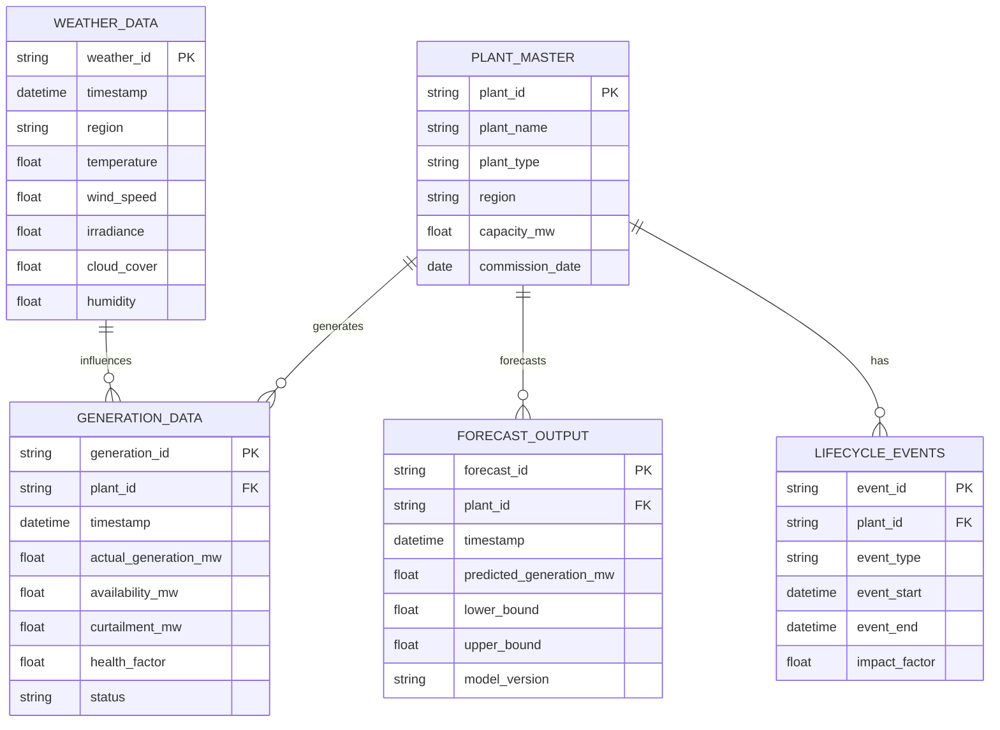

## 1. PLANT_MASTER

|Column|Type|Description|
|---|---|---|
|plant_id|String (PK)|Unique plant identifier|
|plant_name|String|Name of plant|
|plant_type|String|Solar / Wind / Hybrid|
|region|String|Geographic region|
|capacity_mw|Float|Installed capacity|
|commission_date|Date|Start of operations|

##  2. GENERATION_DATA

|Column|Type|Description|
|---|---|---|
|generation_id|String (PK)|Unique record ID|
|plant_id|String (FK)|Links to plant|
|timestamp|Datetime|Hourly timestamp|
|actual_generation_mw|Float|Actual power generated|
|availability_mw|Float|Available capacity|
|curtailment_mw|Float|Reduced output due to grid limits|
|health_factor|Float|Efficiency indicator (0–1)|
|status|String|Active / Maintenance / Fault|

##  3. WEATHER_DATA

|Column|Type|Description|
|---|---|---|
|weather_id|String (PK)|Unique weather record|
|timestamp|Datetime|Hourly timestamp|
|region|String|Region mapping to plants|
|temperature|Float|Temperature (°C)|
|wind_speed|Float|Wind speed (m/s)|
|irradiance|Float|Solar irradiance (W/m²)|
|cloud_cover|Float|% cloud cover|
|humidity|Float|% humidity|

##  4. FORECAST_OUTPUT

|Column|Type|Description|
|---|---|---|
|forecast_id|String (PK)|Unique forecast ID|
|plant_id|String (FK)|Plant reference|
|timestamp|Datetime|Future timestamp|
|predicted_generation_mw|Float|Predicted output|
|lower_bound|Float|Confidence lower bound|
|upper_bound|Float|Confidence upper bound|
|model_version|String|Model tracking|

## 5. LIFECYCLE_EVENTS

|Column|Type|Description|
|---|---|---|
|event_id|String (PK)|Unique event ID|
|plant_id|String (FK)|Plant reference|
|event_type|String|Maintenance / Fault / Upgrade|
|event_start|Datetime|Start time|
|event_end|Datetime|End time|
|impact_factor|Float|Impact on generation|